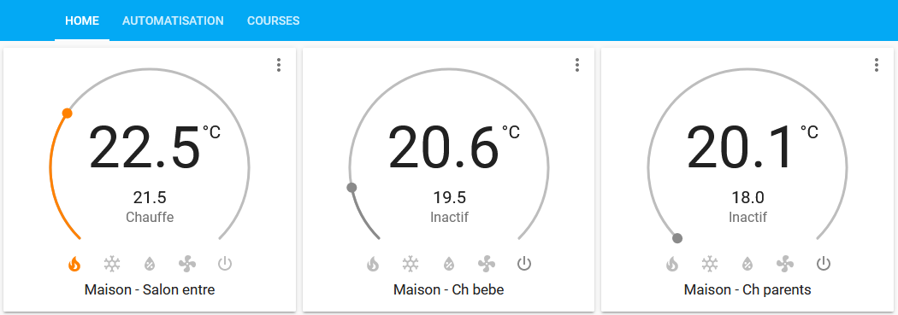

# Airzone Cloud Daikin plugin for Home Assistant

## Why this fork?
This project is a fork of https://github.com/max13fr/Airzonecloud-HomeAssistant from max13fr

I wanted to view & control my Daikin Airzone Cloud from [dkn.airzonecloud.com](https://dkn.airzonecloud.com) with home assistant but with the max13fr code I had an error:
```
ERROR (MainThread) [homeassistant.config] Platform error: climate - No module named 'homeassistant.util.temperature'
Traceback (most recent call last):
  File "/usr/src/homeassistant/homeassistant/config.py", line 1560, in async_process_component_config
    platform = p_integration.get_platform(domain)
               ^^^^^^^^^^^^^^^^^^^^^^^^^^^^^^^^^^
  File "/usr/src/homeassistant/homeassistant/loader.py", line 1010, in get_platform
    return self._load_platform(platform_name)
           ^^^^^^^^^^^^^^^^^^^^^^^^^^^^^^^^^^
  File "/usr/src/homeassistant/homeassistant/loader.py", line 1025, in _load_platform
    cache[full_name] = self._import_platform(platform_name)
                       ^^^^^^^^^^^^^^^^^^^^^^^^^^^^^^^^^^^^
  File "/usr/src/homeassistant/homeassistant/loader.py", line 1058, in _import_platform
    return importlib.import_module(f"{self.pkg_path}.{platform_name}")
           ^^^^^^^^^^^^^^^^^^^^^^^^^^^^^^^^^^^^^^^^^^^^^^^^^^^^^^^^^^^
  File "/usr/local/lib/python3.12/importlib/__init__.py", line 90, in import_module
    return _bootstrap._gcd_import(name[level:], package, level)
           ^^^^^^^^^^^^^^^^^^^^^^^^^^^^^^^^^^^^^^^^^^^^^^^^^^^^
  File "<frozen importlib._bootstrap>", line 1387, in _gcd_import
  File "<frozen importlib._bootstrap>", line 1360, in _find_and_load
  File "<frozen importlib._bootstrap>", line 1331, in _find_and_load_unlocked
  File "<frozen importlib._bootstrap>", line 935, in _load_unlocked
  File "<frozen importlib._bootstrap_external>", line 995, in exec_module
  File "<frozen importlib._bootstrap>", line 488, in _call_with_frames_removed
  File "/config/custom_components/airzoneclouddaikin/climate.py", line 5, in <module>
    from homeassistant.util.temperature import convert as convert_temperature
ModuleNotFoundError: No module named 'homeassistant.util.temperature'
```

So I have made this fork to avoid that error. And with a few changes, I've managed to get it working. Basically I have commented on the conversion that causes the error and I do not notice any errors in its use.

## Introduction

Allow to view & control all your zones register on your *Daikin* Airzone Cloud ([dkn.airzonecloud.com](https://dkn.airzonecloud.com)) account from [Home Assistant](https://www.home-assistant.io/).

If you're looking for the main Airzone Cloud ([airzonecloud.com](https://airzonecloud.com)), use this plugin : https://github.com/max13fr/Airzonecloud-HomeAssistant



## Install / upgrade

### Add module

In your home assistant directory (where you have your **configuration.yaml**) :

- create the directory **custom_components** if not already existing
- copy **custom_components/airzoneclouddaikin** directory from this github repository inside your **custom_components**. In case of upgrade, you can delete the **airzoneclouddaikin** first then copy the new one.

Finally, you should have the following tree :

- configuration.yaml
- custom_components/
  - airzoneclouddaikin/
    - \_\_init\_\_.py
    - climate.py
    - const.py
    - manifest.py

### Configure

In your **configuration.yaml** add the following lines :

```
climate:
  - platform: airzoneclouddaikin
    username: your@mail.com
    password: yourpassword
```

You're username & password should match what you use to connect to https://dkn.airzonecloud.com

Don't forget to restart your Home Assistant when you update your configuration.

#### Change refresh interval

Default refresh interval is **10 seconds**.

You can increase or decrease this value but be warned that you can be banned by Airzone if you refresh too often.

```
climate:
  - platform: airzoneclouddaikin
    username: your@mail.com
    password: yourpassword
    scan_interval: 5
```
